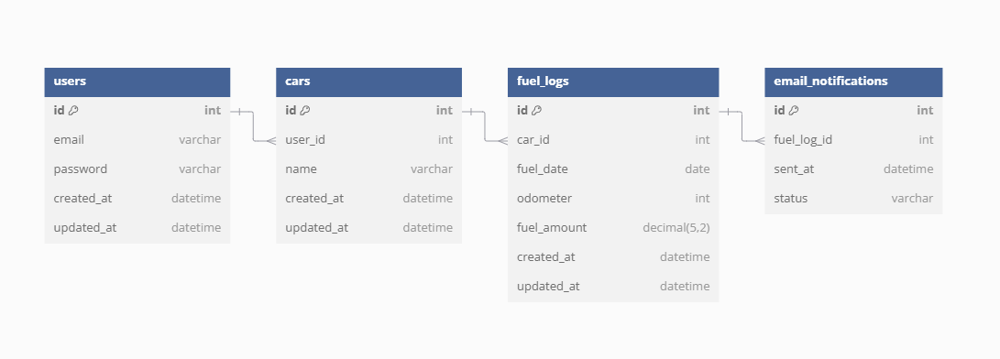

# ER図
下記を使う
https://dbdiagram.io/home

# 画像

# 内容
Table users {
  id int [pk, increment] // ユーザーID
  email varchar           // メールアドレス
  password varchar        // パスワード（ハッシュ値推奨）
  created_at datetime
  updated_at datetime
}

Table cars {
  id int [pk, increment]    // 車ID
  user_id int [ref: > users.id] // 所有者のユーザーID
  name varchar              // 車の名称または識別用ラベル
  created_at datetime
  updated_at datetime
}

Table fuel_logs {
  id int [pk, increment]    // 給油記録ID
  car_id int [ref: > cars.id]   // 対象の車ID
  fuel_date date            // 給油日付
  odometer int              // odometer（走行距離計）の値
  fuel_amount decimal(5,2)  // 給油量（リットル）
  created_at datetime
  updated_at datetime
}

Table email_notifications {
  id int [pk, increment]    // 通知ID
  fuel_log_id int [ref: > fuel_logs.id] // 給油記録に対するメール通知
  sent_at datetime          // メール送信日時
  status varchar            // 送信状況（例: "sent", "failed"）
}
